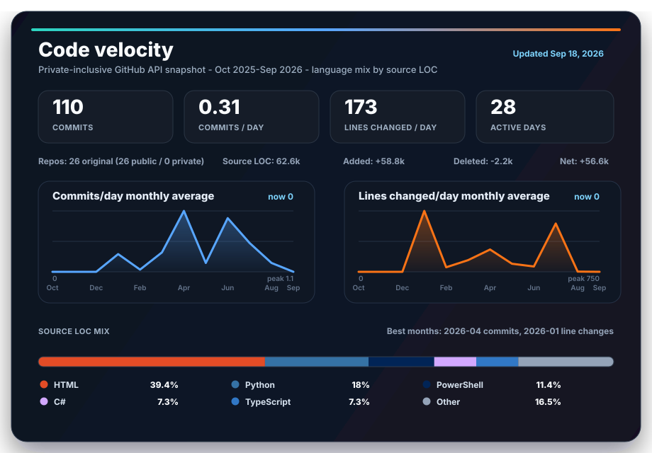

# Hey, I'm Victor Sotero

> Computer scientist from Brazil, building data systems at scale in Sweden.

Senior Data Engineer based in Gothenburg. Over the past 5+ years I've helped design pipelines that processed over a billion transactions, migrated terabyte-scale platforms to the cloud, and built marketing data systems from scratch for companies with hundreds of locations. I care about clean architecture, data governance, and making complex systems feel simple.

* * *

## 🔭 Where I've been

- **Zeekr Technology Europe** — Part of the team building an EU-integrated data platform that unites scattered data sources across European operations, helping shape the approach to EU Data Act compliance and governance.
- **JCPenney** — Played a key role in bringing the Marketing Technology data platform in-house, replacing an outsourced solution. Helped design the pipelines, migrate the data, and keep Big Data processing running smoothly across 650+ store locations on AWS.
- **Adobe** — Contributed to the migration of terabyte-scale workloads from on-premises Cloudera/Hive to AWS EMR and S3 — work that meaningfully reduced operational costs and improved scalability.
- **Banco Inter** — Helped migrate legacy SQL procedures to PySpark and process billions of CDC transactions via Kafka into Delta Tables for one of Brazil's largest digital banks.

* * *

## 🛠 Tech Stack

**Languages**
`Python` `SQL` `TypeScript`

**Data Processing**
`PySpark` `Apache Spark` `Databricks` `Delta Lake` `dbt`

**Cloud & Infrastructure**
`AWS EMR` `S3` `Redshift` `Glue` `Terraform` `Docker` `Cloudera` `Trino`

**Orchestration & CI/CD**
`Airflow` `GitLab CI/CD` `GitHub Actions` `Oozie`

**Streaming & Integration**
`Kafka` `Change Data Capture`

**Data Architecture**
`Data Lakehouse` `Data Modeling` `ETL/ELT`

* * *

## 📊 Code Metrics

## 📌 What I'm up to

- Building EU-compliant data platforms at **Zeekr** with Databricks, Unity Catalog, and Terraform
- Designing governance and ingestion pipelines for cross-border data operations
- Exploring AI-driven data augmentation and NLP side projects
- Always looking for better ways to make data accessible and trustworthy

* * *

## 📚 Background

I started in academia — researching educational technologies and NLP for chatbot interactions at university in Maceió, Brazil. That research background shaped how I think about problems: methodically, with an eye for what the data is actually telling you.

- **Databricks Certified** Data Engineer Associate
- **University of Michigan** — Machine Learning & Data Visualization certifications
- **CSEDU International Conference** — Published research on educational technologies in medical education

* * *

## 📫 Let's connect

